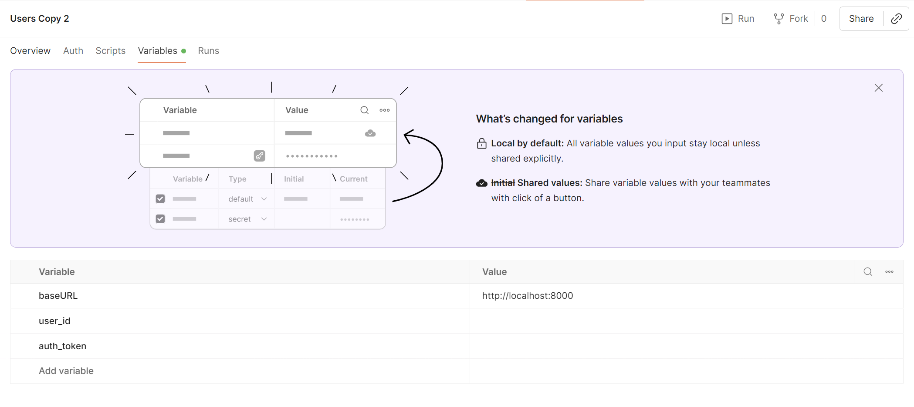
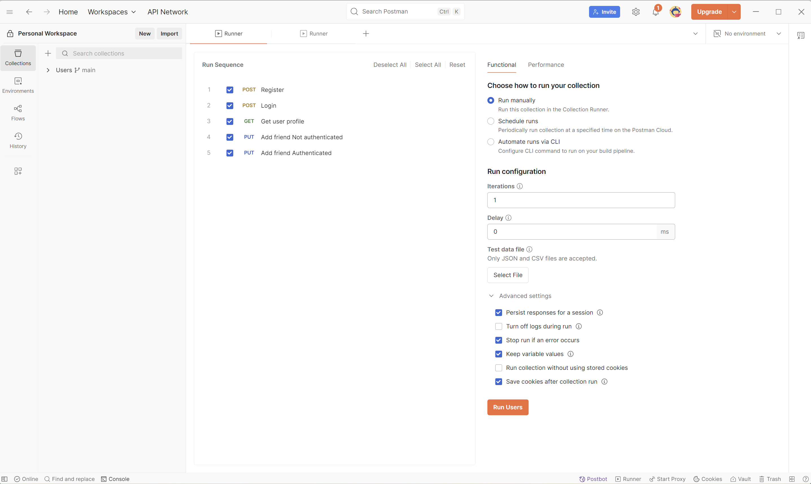

# HL Architecture Homework

Проект представляет собой веб-приложение на Flask с REST API и PostgreSQL базой данных, включающий acceptance тесты и документацию.

## Структура проекта

```
hl-arch-homework/
├── app/                    # Основное Flask приложение
├── acceptance-tests/       # Приемочные тесты
├── docs/                  # Документация проекта
├── postman/               # Postman коллекции для тестирования API
└── README.md             # Основная документация проекта
```

## Компоненты

### 🚀 [Основное приложение](app/README.md)
Flask REST API с PostgreSQL базой данных. Включает:
- REST API эндпоинты (см. [openapi.json](app/infra/rest/spec/openapi.json))
- PostgreSQL с Alembic миграциями
- Docker контейнеризация

**Подробности:** [app/README.md](app/README.md)

### 🧪 [Приемочные тесты](acceptance-tests/README.md)
Автоматизированные тесты для проверки функциональности API:
- Изолированная тестовая среда
- Скрипты запуска для Windows и Unix систем
- Автоматическая очистка данных

**Подробности:** [acceptance-tests/README.md](acceptance-tests/README.md)

### 🧪 API тестирование
- `postman/collections/` - коллекции Postman для ручного тестирования API

## Быстрый старт

### Запуск основного приложения и необходимых сервисов
```bash
cd app
docker-compose up --build
```

### Запуск приемочных тестов
```bash
cd acceptance-tests
# Windows
.\run_tests.ps1
# Linux/macOS
./run_tests.sh
```

### Запуск приемочных тестов в Postman

1. Импортировать [Postman коллекцию Users](postman/collections/2627899-bc4e17db-742c-4420-810b-495f8782c9b6.json) либо в качестве файла, либо путем синхронизации с Git-репозиторием.
1. На карточке коллекции в табе Variables установить значение `baseURL`

    ```
    http://localhost:8000
    ```

    

1. Запустить основное приложение.
1. В контекстном меню коллекции или в карточке коллекции нажать Run.
1. На форме запуска сохранить оригинальный порядок в коллекции и запустить (кнопка Run Users).

    

1. Запросы в коллекции снабжены тестами и управлением переменными. По мере выполнения тестов устанавливаются и читаются переменные __коллекции__.

## Требования

- Docker
- Postman
- Bash/PowerShell

## Разработка

Для разработки и тестирования используйте соответствующие README файлы в каждой папке:
- [app/README.md](app/README.md) - для работы с основным приложением
- [acceptance-tests/README.md](acceptance-tests/README.md) - для работы с тестами

## Лицензия

Проект создан в рамках домашнего задания по архитектуре.
